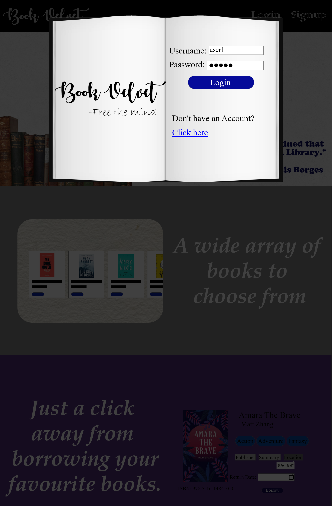
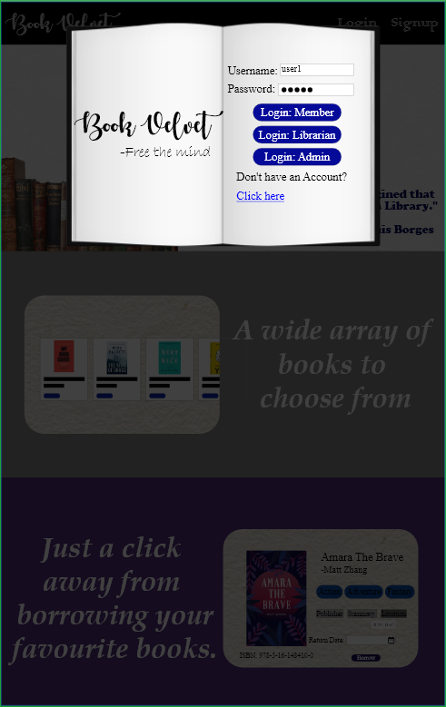
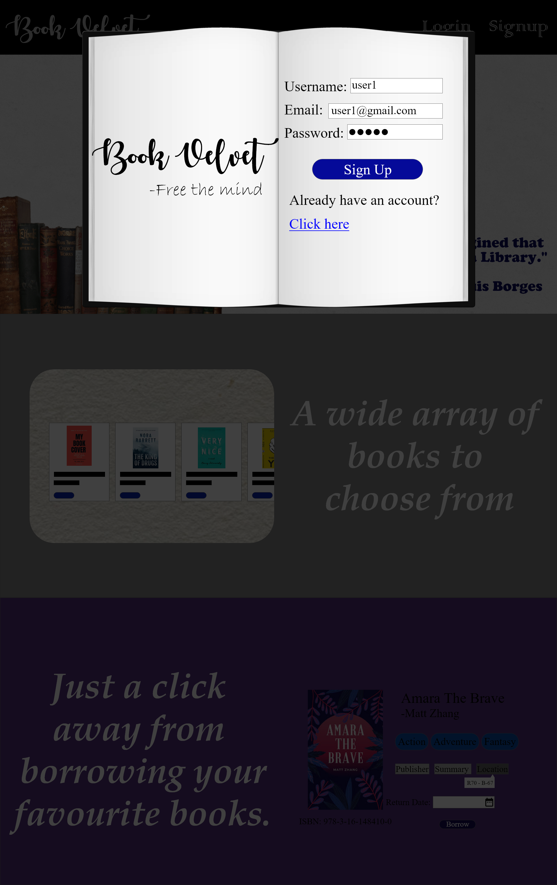
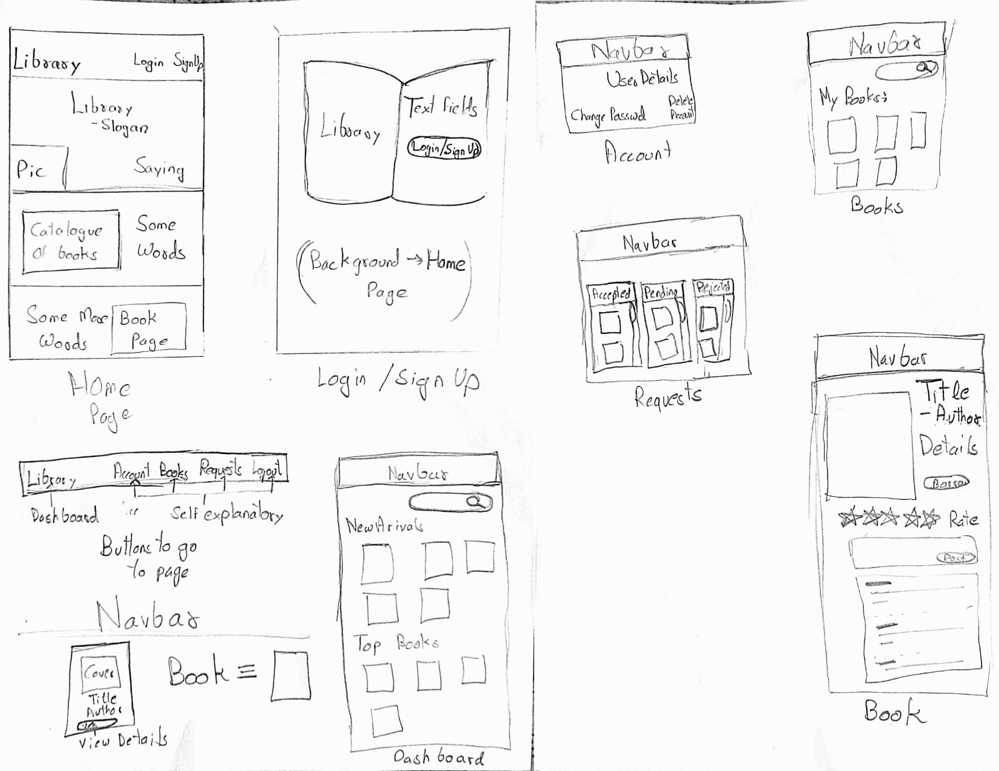
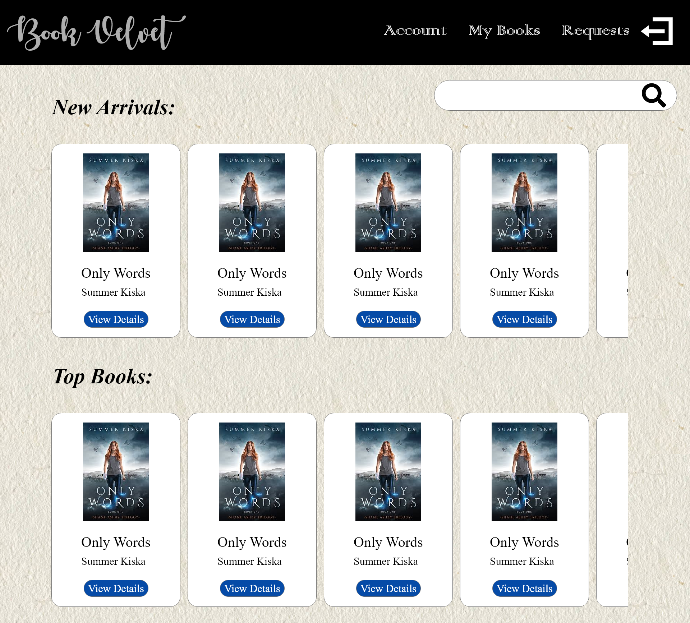
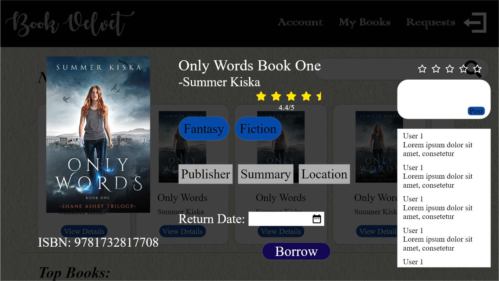
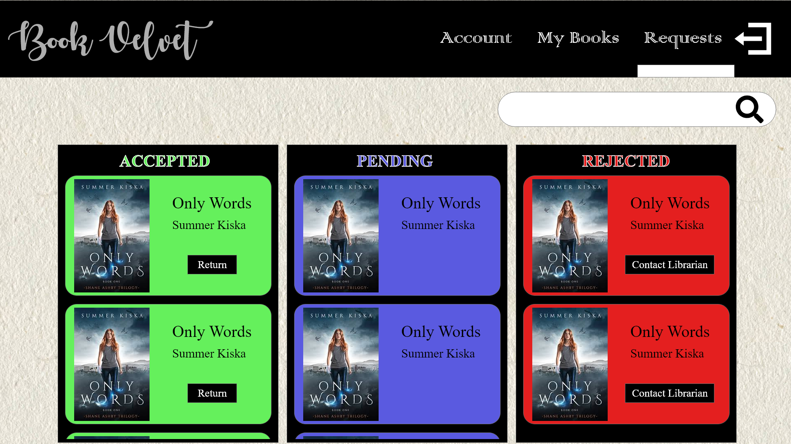

# Library Web App Design

This is how I would design the library management web app if I had the time
 

## Table of Contents  
 - [Interface](#interface)  
 - [Inspiiration](#inspiration)
 - [Initial Idea And Changes](#initial-idea-and-changes)
 - [Different Screen Sizes and Accessability](#different-screen-sizes-and-accessability)  

 
<a name="interface"/>

## Interface
The interface follows the same design for all the types of users: admins, librarians and members. 
In the actual website, you would be able to do specific tasks based on the type of user you are. So, there would only be one login button, and the tasks you can do are  determined in the backend.
 

 
However, in order to show the interface for all types of users, I added a login button for each type of user.
 
 
 
Also, when you sign up, you are automatically made a member.
 

 
<a name="inspiration"/>

## Inspiration

The ispiration came from apps like playstore and how they show you a large number of apps by allowing you to scroll through the options. The inspiration for the background came from the tutorial of django that I saw on youtube.

<a name="initial-idea-and-changes"/>

## Initial Idea And Changes

 
Initially, I only thought of doing the member version of the app. However, I soon realized that I could make the other artboards very quickly if I used copy-paste and edited them a  little.
 
Also, instad of scrolling through the entire screen, I made it such that the user can scroll through the books, comments and requests without disturbing anything else on the screen
 

 

<a name="different-screen-sizes-and-accessability"/>

## Different Screen Sizes and Accessability
Due to shorage of time, I was not able to make the abbb adapt fit to different screen sizes nor did I think much about accessability as I was also busy with the part I assignment. However, in the future, I would like to correct these shortcomings.

